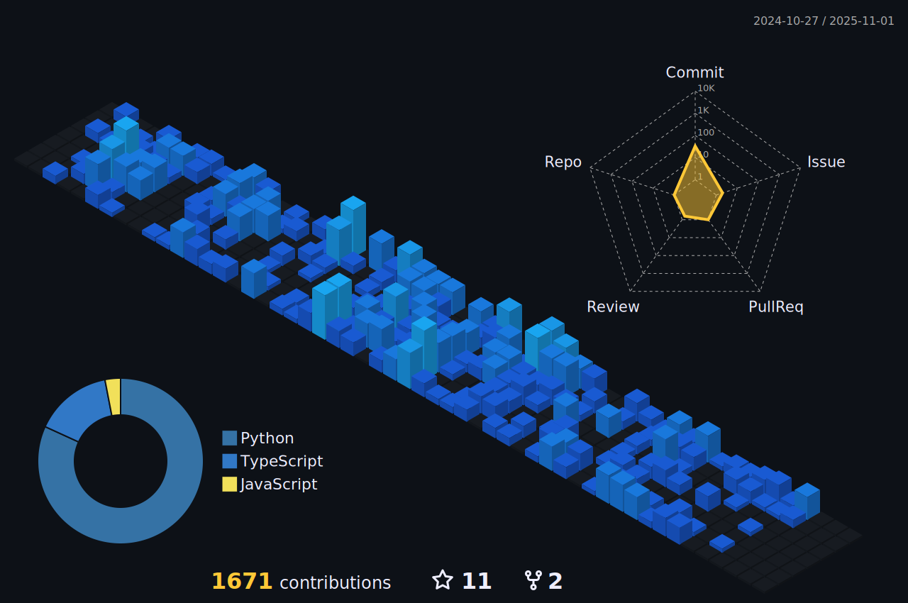

<h1 align="center">
  Hi !
  
</h1>

<h6 align="center">🇫🇷 French student</h6>

  <a href="tholeb.fr">
    
    
     
    
  </a>

## 🧑 About me

I'm a french IT engineering school student France. I'm mainly interested in the DevSecOps field. <b>If you are looking for an intern, feel free to contact me on Linkedin !</b>

   

## 🛠️ Techs

 
 
 

 
 

 
 

 

<!-- <h2>💻 &nbsp;Recent Activities</h2> -->

<!--START_SECTION:activitySTOP-->

<h2>ℹ️ &nbsp;Github Info</h2>

 
<b>🌐 Refs</b>

  <ol>
    <li><a href="https://github.com/rzashakeri/beautify-github-profile">rzashakeri/beautify-github-profile</a></li>
    <li><a href="https://github.com/github/explore/tree/main/topics">Images</a></li>
    <li><a href="https://github.com/Ileriayo/markdown-badges">Ileriayo/markdown-badges</a></li>
    <li><a href="https://github.com/leviarista/github-profile-header-generator">leviarista/github-profile-header-generator</a></li>
    <li><a href="https://github.com/yoshi389111/github-profile-3d-contrib">yoshi389111/github-profile-3d-contrib</a></li>
  <ol>

<!-- 

  
<b>🔎 Github Profile Details</b>

  

 -->

<!-- 

  
<b>⚡ Github Stats</b>

  

    
  
  
  

 -->

<!-- 

 
<b>🔥 Github Streaks</b>

  

    
  

 -->
